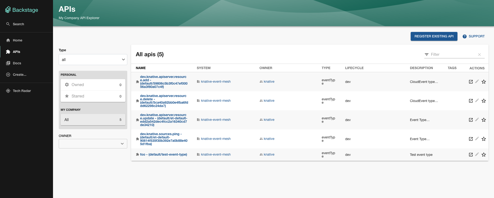

# Knative Backstage Plugins

This repository contains a set of Backstage plugins for Knative and their respective backends.

## Installation and usage

### Event Mesh plugin

The Event Mesh plugin is a Backstage plugin that allows you to view and manage Knative Eventing resources.

The Backstage plugin talks to a special backend that runs in the Kubernetes cluster and communicates with the Kubernetes
API server.

#### Installation

Install the backend and the relevant configuration in the Kubernetes cluster

```bash
kubectl apply -f https://github.com/knative-extensions/backstage-plugins/releases/download/v0.1.0/eventmesh.yaml
```

In your Backstage directory, run the following command to install the plugin:

```bash
yarn workspace backend add @knative-extensions/plugin-knative-event-mesh-backend
```

#### Configuration

> **NOTE**: The backend needs to be accessible from the Backstage instance. If you are running the backend without
> exposing it, you can use `kubectl port-forward` to forward the port of the backend service to your local machine.
> ```bash
> kubectl port-forward -n knative-eventing svc/eventmesh-backend 8080:8080
> ```


The plugin needs to be configured to talk to the backend. It can be configured in the `app-config.yaml` file of the
Backstage instance and allows configuration of one or multiple providers.

Use a `knativeEventMesh` marker to start configuring the `app-config.yaml` file of Backstage:

```yaml
catalog:
  providers:
    knativeEventMesh:
      dev:
        baseUrl: 'http://localhost:8080' # URL of the backend installed in the cluster
        schedule: # optional; same options as in TaskScheduleDefinition
          # supports cron, ISO duration, "human duration" as used in code
          frequency: { minutes: 1 }
          # supports ISO duration, "human duration" as used in code
          timeout: { minutes: 1 }
```

Configure the scheduler for the entity provider. Add the following code to `packages/backend/src/plugins/catalog.ts`
file:

In file `packages/backend/src/plugins/catalog.ts`:

```ts
import { KnativeEventMeshProvider } from '@knative-extensions/plugin-knative-event-mesh-backend';

export default async function createPlugin(
  env: PluginEnvironment,
): Promise<Router> {
  const builder = await CatalogBuilder.create(env);

  /* ... other processors and/or providers ... */
  
  // ADD THIS
  builder.addEntityProvider(
      KnativeEventMeshProvider.fromConfig(env.config, {
      logger: env.logger,
      scheduler: env.scheduler,
    }),
  );
  
  /* ... other processors and/or providers ... */

  const { processingEngine, router } = await builder.build();
  await processingEngine.start();
  return router;
}
```

> **NOTE**: If you have made any changes to the schedule in the `app-config.yaml` file, then restart to apply the
> changes.

#### Troubleshooting

When you start your Backstage application, you can see some log lines as follows:

```text
[1] 2024-01-04T09:38:08.707Z knative-event-mesh-backend info Found 1 knative event mesh provider configs with ids: dev type=plugin
```

#### Usage

The plugin will register a few entities in the Backstage catalog.

Screenshots:

- 

- 

## Development

### Event Mesh plugin

The architecture of the plugin is as follows:
```
      Kubernetes                        Backstage
┌────────────────────┐           ┌─────────────────────┐
│                    │           │                     │
│ ┌───────────────┐  │           │       Plugin        │
│ │               │  │           │ ┌─────────────────┐ │
│ │    Backend    ◄──┼────┐      │ │                 │ │
│ │               │  │    │      │ │ ┌─────────────┐ │ │
│ └───────┬───────┘  │    │      │ │ │             │ │ │
│         │          │    └──────┼─┼─┤  Provider   │ │ │
│         │          │           │ │ │             │ │ │
│         │          │           │ │ └─────────────┘ │ │
│ ┌───────▼───────┐  │           │ │                 │ │
│ │               │  │           │ └─────────────────┘ │
│ │   API Server  │  │           │                     │
│ │               │  │           └─────────────────────┘
│ └───────────────┘  │
│                    │
└────────────────────┘
```

The plugin use providers (and possibly other mechanisms) to communicate with a special backend-for-frontend.

This backend talks to the Kubernetes API server to get information about the resources in the cluster.

#### Running the backend

The backend is a Go project that runs in a Kubernetes cluster.

Prerequisites:
- To run the backend, you need to have a Kubernetes cluster running and the `kubectl` command line tool installed.
- Also, you need [`ko`](https://github.com/ko-build/ko) [installed](https://ko.build/install/) and [configured](https://ko.build/configuration/#basic-configuration).

```bash
# Build and deploy the backend
ko apply -f ./backends/config/100-eventmesh/
```

Check that the backend is running:
```bash
# proxy the backend service
kubectl port-forward -n knative-eventing svc/eventmesh-backend 8080:8080

# check that the backend is running
curl -v http://localhost:8080/

{
  "eventTypes":[{"name":"test-event-type","namespace":"default","type":"foo","uid":"8a44f223-c2e5-4cc1-a578-cc81c6ea2898"}],
  "brokers":[{"name":"default","namespace":"default","uid":"d44e3cfa-5866-43fd-a8ed-b3a3436beecd"}]
}
```

#### Running the Backstage plugin

The plugin is enabled inside the Backstage instance that is in `./backstage` directory.

Prerequisites:
- To run the plugin, you need to have the `yarn` command line tool installed.

First, install dependencies:
```bash
# Install dependencies
cd ./backstage
yarn install --frozen-lockfile
```

The default configuration of the plugin is to use the backend at `http://localhost:8080`.

[Start](#running-the-backend) and proxy the backend service:
```bash
# proxy the backend service
kubectl port-forward -n knative-eventing svc/eventmesh-backend 8080:8080
```

Then, start the backstage instance:
```bash
cd ./backstage
yarn dev
```
