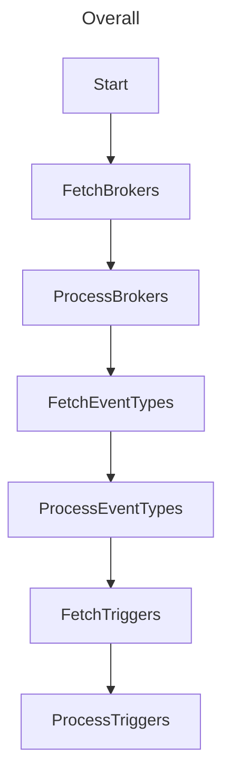
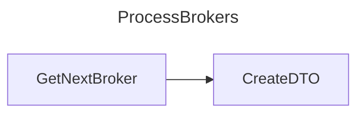
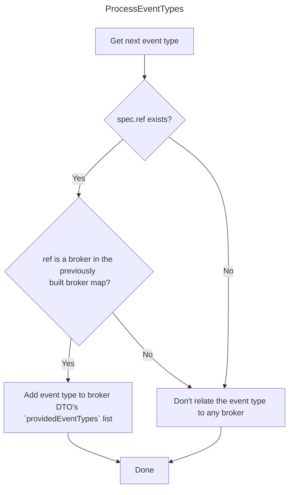
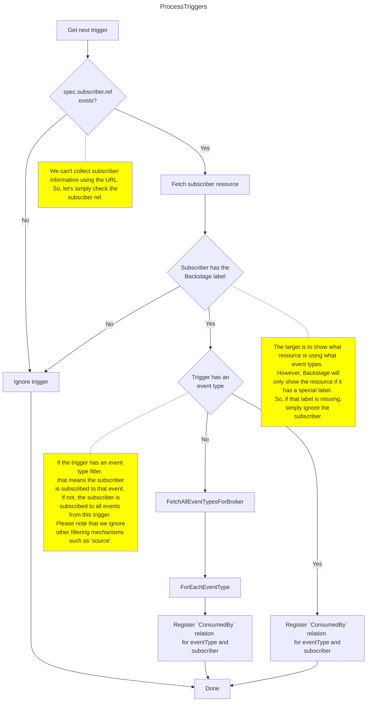

# Knative Backstage Plugins

This repository contains a set of Backstage plugins for Knative and their respective backends.

## Installation and usage

### Event Mesh plugin

See [Event Mesh plugin README file](./backstage/plugins/knative-event-mesh-backend/README.md) for more information.

## Development

### Event Mesh plugin

The architecture of the plugin is as follows:
```
      Kubernetes                                     Backstage
┌────────────────────┐           ┌───────────────────────────────────────────────┐
│                    │           │       Plugin                                  │
│ ┌───────────────┐  │           │ ┌─────────────────┐        ┌───────────────┐  │
│ │               │  │           │ │                 │        │               │  │
│ │    Backend    ◄──┼────┐      │ │ ┌─────────────┐ │        │               │  │
│ │               │  │    │      │ │ │             │ │        │               │  │
│ └───────┬───────┘  │    └──────┼─┼─┤  Provider   ├─┼────────►               │  │
│         │          │           │ │ │             │ │        │               │  │
│         │          │           │ │ └─────────────┘ │        │               │  │
│         │          │           │ │                 │        │               │  │
│ ┌───────▼───────┐  │           │ │                 │        │               │  │
│ │               │  │           │ │        ┌────────┼────────┤   Catalog     │  │
│ │   API Server  │  │           │ │        │        │        │               │  │
│ │               │  │           │ │        │        │        │               │  │
│ └───────────────┘  │           │ │ ┌──────▼──────┐ │        │               │  │
│                    │           │ │ │             │ │        │               │  │
└────────────────────┘           │ │ │ Processor   ├─┼────────►               │  │
                                 │ │ │             │ │        │               │  │
                                 │ │ └─────────────┘ │        │               │  │
                                 │ │                 │        │               │  │
                                 │ └─────────────────┘        └───────────────┘  │
                                 └───────────────────────────────────────────────┘
```

The plugin use providers (and possibly other mechanisms) to communicate with a special backend-for-frontend.

This backend talks to the Kubernetes API server to get information about the resources in the cluster.



## Processing the brokers



## Processing the event types



## Processing the triggers



#### Running the backend

The backend is a Go project that runs in a Kubernetes cluster.

Prerequisites:
- To run the backend, you need to have a Kubernetes cluster running and the `kubectl` command line tool installed.
- Also, you need [`ko`](https://github.com/ko-build/ko) [installed](https://ko.build/install/) and [configured](https://ko.build/configuration/#basic-configuration).

```bash
# Build and deploy the backend
ko apply -f ./backends/config/100-eventmesh/
```

Check that the backend is running:
```bash
# proxy the backend service
kubectl port-forward -n knative-eventing svc/eventmesh-backend 8080:8080

# check that the backend is running
curl -v http://localhost:8080/
```

You will get a `401 Unauthorized` response, which is expected.

Now you need to create a token to authenticate with the backend. That is documented in
the [Event Mesh plugin README file](./backstage/plugins/knative-event-mesh-backend/README.md).

```bash
{
  "eventTypes":[{"name":"test-event-type","namespace":"default","type":"foo","uid":"8a44f223-c2e5-4cc1-a578-cc81c6ea2898"}],
  "brokers":[{"name":"default","namespace":"default","uid":"d44e3cfa-5866-43fd-a8ed-b3a3436beecd"}]
}
```

#### Running the Backstage plugin

The plugin is enabled inside the Backstage instance that is in `./backstage` directory.

Prerequisites:
- To run the plugin, you need to have the `yarn` command line tool installed.

First, install dependencies:
```bash
# Install dependencies
cd ./backstage
yarn install --frozen-lockfile
```

The default configuration of the plugin is to use the backend at `http://localhost:8080`.

Ensure the [backend](#running-the-backend) is running, and then, start the Backstage instance:
```bash
cd ./backstage
yarn dev
```

By default, Backstage App can be accessed at `http://localhost:3000`.

If Backstage App is running as a Kubernetes deployment, it could be accessed over ingress by doing changes specified 
[here](./backstage/README.md#ingress-configuration).

#### Testing GitHub Actions

You need `act` installed: https://github.com/nektos/act

```bash

# Specify the job to run
act -j '<job name>'
# ex:
# act -j 'publish-release-snapshot-on-npm'
# if having issues on Apple Silicon, use:
# act --rm --container-architecture linux/amd64 -j 'publish-release-snapshot-on-npm'
```
