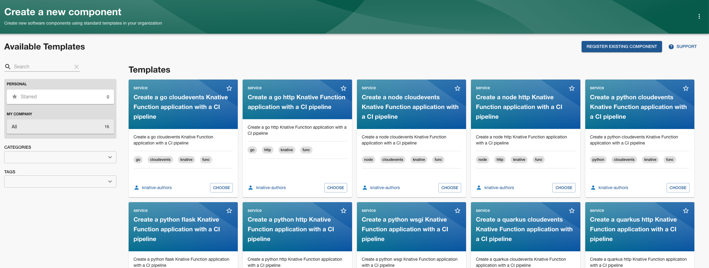

# Knative Functions Backstage templates

This repository contains a set of Backstage templates for Knative Functions.

These templates are generated using Knative Functions CLI and modified to be used with Backstage.

## Installation and usage

In order to use these templates, you need to register the templates in Backstage. Also, since
the templates are generating some code, you need some storage. The default storage provided by the templates is GitHub by pushing the code into a new repository.

### Setting up GitHub integration

As shown in the [Backstage documentation](https://backstage.io/docs/integrations/github/locations), you need to set up a GitHub integration in Backstage.

In your `app-config.yaml`, you need to add the following configuration:
```yaml
...
integrations:
  github:
    - host: github.com
      token: ${GITHUB_TOKEN}
```

See the Backstage documentation for more options on this integration.

The `GITHUB_TOKEN` is an environment variable that you need to set before running Backstage.

### Registering the templates

In your `app-config.yaml`, you need to add the following configuration:
```yaml
...
catalog:
  ...
  locations:
    - type: file
      target: https://github.com/knative-extensions/backstage-plugins/blob/main/backstage/templates/location.yaml
      # Change the version to a specific version if you want to lock the version
      # target: https://github.com/knative-extensions/backstage-plugins/blob/knative-v1.16.0/backstage/templates/location.yaml
      rules:
        - allow: [ Location, Template ]
```

### Starting up the Backstage instance

After setting up the GitHub integration and registering the templates, you can start the Backstage instance.

```bash
cd ./backstage
export GITHUB_TOKEN=<your-github-token>
# use gh cli, if you have it
export GITHUB_TOKEN=`gh auth token`
yarn dev
```

### Using the templates

The templates will show up in the Backstage catalog. You can create a new repository by using the templates.



